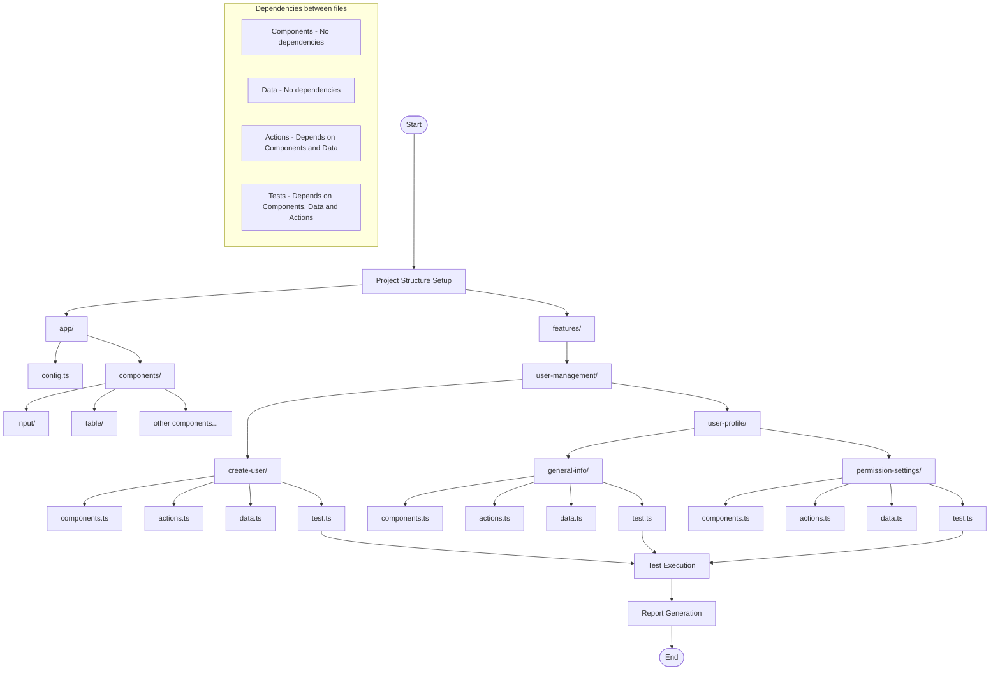

## Test Architecture Based on the Vertical Slice Approach Using Playwright



My approach to automated testing is based on the vertical slice architecture, which organizes code by functionality instead of technical layers. This ensures that all test components related to a specific functionality are grouped together, which increases readability and ease of code maintenance.

#### Project Structure

```
├── app/
│   ├── config.ts
│   └── components/
│       ├── input/
│       ├── table/
│       └── ...
└── features/
    └── user-management/
        ├── create-user/
        │   ├── components.ts
        │   ├── actions.ts
        │   ├── data.ts
        │   └── test.ts
        └── user-profile/
            ├── general-info/
            │   ├── components.ts
            │   ├── actions.ts
            │   ├── data.ts
            │   └── test.ts
            └── permission-settings/
                ├── components.ts
                ├── actions.ts
                ├── data.ts
                └── test.ts
```

#### Responsibilities of Individual Files

Each functionality module contains four key types of files with a strict separation of responsibilities:

1. **Components (`components.ts`)**
   - Contains only UI element locators
   - No dependencies on other files
   - Example:
     ```typescript
     export class CreateUserComponents {
       readonly addButton = this.page.locator('text="+ Create User"');
       readonly nameField = this.page.locator('[data-testid="name-field"]');
       readonly saveButton = this.page.locator('text="Save"');
       
       constructor(private page: Page) {}
     }
     ```

2. **Data (`data.ts`)**
   - Contains test data and required types
   - No dependencies on other files
   - Example:
     ```typescript
     export const UserData = {
       Valid: {
         role: 'admin',
         name: 'John Smith',
         email: 'john.smith@example.com',
         // other data
       },
       Invalid: {
         EmptyName: {
           role: 'admin',
           name: '',
           email: 'john.smith@example.com',
           // other data
         },
         // other sets of invalid data
       }
     };
     ```

3. **Actions (`actions.ts`)**
   - Contains page interactions without assertions
   - Depends on Components and Data
   - Example:
     ```typescript
     export class CreateUserActions {
       private components: CreateUserComponents;
       
       constructor(private page: Page) {
         this.components = new CreateUserComponents(page);
       }
       
       async fillForm(data: typeof UserData.Valid) {
         await this.components.nameField.fill(data.name);
         // filling other fields
       }
       
       async submitForm() {
         await this.components.saveButton.click();
       }
     }
     ```

4. **Tests (`test.ts`)**
   - Contains test cases with assertions
   - Depends on Components, Data, and Actions
   - Example:
     ```typescript
     test.describe("CreateUser", () => {
       test.beforeEach(async ({ page }) => {
         await new AuthActions(page).loginAsAdmin();
       });
       
       test("TC_User_001.GivenValidUserData_WhenSubmitForm_ThenUserIsCreated", async ({ page }) => {
         const { fillForm, submitForm } = new CreateUserActions(page);
         await fillForm(UserData.Valid);
         await submitForm();
         await expect(page.locator('.notification')).toContainText('User created successfully');
       });
       
       test("TC_User_002.GivenMissingName_WhenSubmitForm_ThenErrorDisplayed", async ({ page }) => {
         const { fillForm, submitForm } = new CreateUserActions(page);
         await fillForm(UserData.Invalid.EmptyName);
         await submitForm();
         await expect(page.locator('.field-error')).toBeVisible();
       });
     });
     ```

Although I try to avoid using page.locator and hardcoded string/number data in tests,
Locators go to components, and data goes to data - this makes modification in one place easier.

**This is an example - real code is in the GitHub repository.**

#### Benefits of this Architecture

1. **Clear Separation of Responsibilities**
   - Each file has a single responsibility
   - Dependencies flow in one direction

2. **Reusability**
   - Components and actions can be reused across multiple tests
   - Data patterns can be templated and extended

3. **Ease of Maintenance**
   - Locator changes need to be updated only in component files
   - Business logic changes only affect action files

4. **Readability**
   - Tests follow the Given-When-Then pattern
   - Descriptive test names provide documentation

5. **Scalability**
   - New features can be added without modifying existing ones
   - Common patterns can be standardized across the codebase

### This architecture works particularly well in testing complex applications, especially when dealing with functionalities that have multiple states and variants, such as the user management system described above.