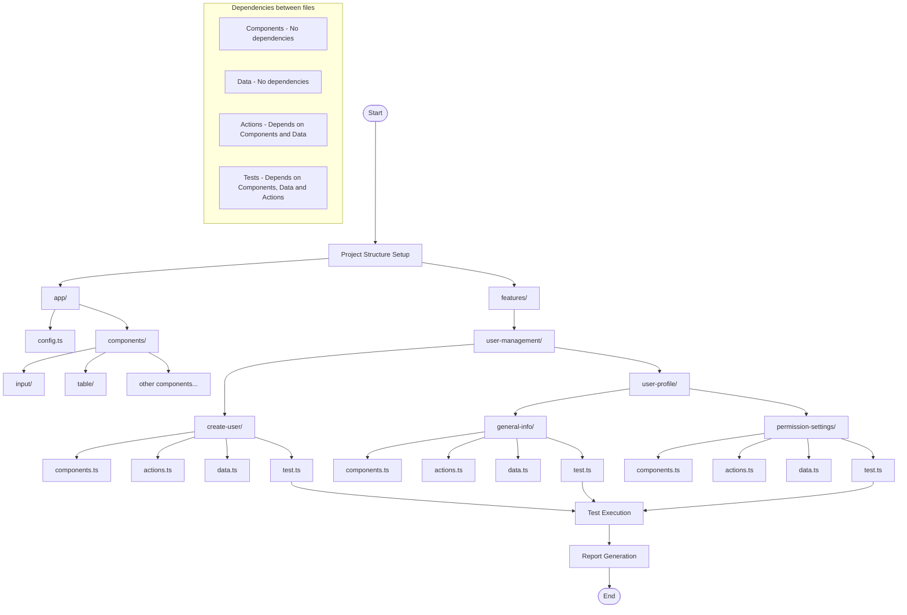

## Architektura testów oparta na podejściu Vertical Slice z wykorzystaniem Playwright.

Moje podejście do testów automatycznych opiera się na architekturze vertical slice, która organizuje kod według funkcjonalności zamiast warstw technicznych. Dzięki temu wszystkie komponenty testowe związane z konkretną funkcjonalnością są zgrupowane razem, co zwiększa czytelność i łatwość utrzymania kodu.

#### Struktura projektu

```
├── app/
│   ├── config.ts
│   └── components/
│       ├── input/
│       ├── table/
│       └── ...
└── features/
    └── user-management/
        ├── create-user/
        │   ├── components.ts
        │   ├── actions.ts
        │   ├── data.ts
        │   └── test.ts
        └── user-profile/
            ├── general-info/
            │   ├── components.ts
            │   ├── actions.ts
            │   ├── data.ts
            │   └── test.ts
            └── permission-settings/
                ├── components.ts
                ├── actions.ts
                ├── data.ts
                └── test.ts
```

#### Odpowiedzialność poszczególnych plików

Każdy moduł funkcjonalności zawiera cztery kluczowe typy plików z ścisłym podziałem odpowiedzialności:

1. **Components (`components.ts`)**
   - Zawiera tylko lokatory elementów UI
   - Brak zależności od innych plików
   - Przykład:
     ```typescript
     export class CreateUserComponents {
       readonly addButton = this.page.locator('text="+ Create User"');
       readonly nameField = this.page.locator('[data-testid="name-field"]');
       readonly saveButton = this.page.locator('text="Save"');
       
       constructor(private page: Page) {}
     }
     ```

2. **Data (`data.ts`)**
   - Zawiera dane testowe i wymagane typy
   - Brak zależności od innych plików
   - Przykład:
     ```typescript
     export const UserData = {
       Valid: {
         role: 'admin',
         name: 'John Smith',
         email: 'john.smith@example.com',
         // inne dane
       },
       Invalid: {
         EmptyName: {
           role: 'admin',
           name: '',
           email: 'john.smith@example.com',
           // inne dane
         },
         // inne zestawy niepoprawnych danych
       }
     };
     ```

3. **Actions (`actions.ts`)**
   - Zawiera interakcje ze stroną bez asercji
   - Zależy od Components i Data
   - Przykład:
     ```typescript
     export class CreateUserActions {
       private components: CreateUserComponents;
       
       constructor(private page: Page) {
         this.components = new CreateUserComponents(page);
       }
       
       async fillForm(data: typeof UserData.Valid) {
         await this.components.nameField.fill(data.name);
         // wypełnianie innych pól
       }
       
       async submitForm() {
         await this.components.saveButton.click();
       }
     }
     ```

4. **Tests (`test.ts`)**
   - Zawiera przypadki testowe z asercjami
   - Zależy od Components, Data i Actions
   - Przykład:
     ```typescript
     test.describe("CreateUser", () => {
       test.beforeEach(async ({ page }) => {
         await new AuthActions(page).loginAsAdmin();
       });
       
       test("TC_User_001.GivenValidUserData_WhenSubmitForm_ThenUserIsCreated", async ({ page }) => {
         const { fillForm, submitForm } = new CreateUserActions(page);
         await fillForm(UserData.Valid);
         await submitForm();
         await expect(page.locator('.notification')).toContainText('User created successfully');
       });
       
       test("TC_User_002.GivenMissingName_WhenSubmitForm_ThenErrorDisplayed", async ({ page }) => {
         const { fillForm, submitForm } = new CreateUserActions(page);
         await fillForm(UserData.Invalid.EmptyName);
         await submitForm();
         await expect(page.locator('.field-error')).toBeVisible();
       });
     });
     ```

Choć staram się unikać w testach stosowania page.locator i hardcodowanych w testach danych string/number 
Locatory do components, a dane do data - ułatwia to modyfikację w jednym miejscu.

**To przykład - real code w repo na github'ie.**

#### Korzyści z tej architektury

1. **Wyraźny podział odpowiedzialności**
   - Każdy plik ma jedną odpowiedzialność
   - Zależności płyną w jednym kierunku

2. **Możliwość ponownego wykorzystania**
   - Komponenty i akcje mogą być ponownie używane w wielu testach
   - Wzorce danych można templować i rozszerzać

3. **Łatwość utrzymania**
   - Zmiany lokatorów muszą być aktualizowane tylko w plikach komponentów
   - Zmiany logiki biznesowej wpływają tylko na pliki akcji

4. **Czytelność**
   - Testy podążają za wzorcem Given-When-Then
   - Opisowe nazwy testów zapewniają dokumentację

5. **Skalowalność**
   - Nowe funkcje można dodawać bez modyfikowania istniejących
   - Wspólne wzorce można standaryzować w całej bazie kodu

### Ta architektura sprawdza się szczególnie dobrze w testowaniu złożonych aplikacji, zwłaszcza gdy mamy do czynienia z funkcjonalnościami posiadającymi wiele stanów i wariantów, jak system zarządzania użytkownikami opisany powyżej.
