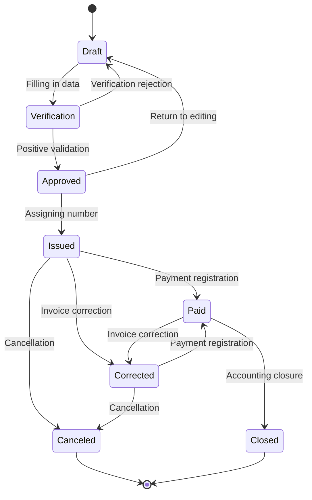

### Automated Testing Methodology for the Invoice Module

My approach to automating tests for the invoice module is based on a solid process that ensures high quality and testing effectiveness. Below, I describe my typical process:

#### **1. Manual Testing as the Foundation**

Before I proceed with automation, I always test the functionality manually first. This allows me to understand the invoicing system and identify potential issues that may require special attention during automation.

#### **2. Documentation Analysis**

- If documentation is available (specifications, user stories, use cases) - I analyze it thoroughly
- In case of missing documentation, I apply an exploratory approach to discover all aspects of the invoice module

#### **3. Testing Positive Paths**

I start with the "happy path" - the basic, correct user path. For invoices, this includes the full invoice lifecycle - from creation, through approval, issuance, to payment.

#### **4. Creating Test Scenarios**

Based on the acquired knowledge, I create test scenarios for invoices, which then help me extract specific test cases. Example scenarios for invoices:
- Adding a new invoice
- Editing an invoice in Draft state
- Validation of required invoice fields
- Issuing an invoice
- Canceling an invoice
- Creating a correction invoice

#### **5. Testing Negative Paths**

After testing positive paths, I focus on negative tests - checking how the system responds to incorrect invoice data, exceeding value limits, or unusual user interactions.

#### **6. Applying Testing Techniques**

I use various testing techniques, such as:
- Equivalence classes - grouping invoice data into categories (e.g., different types of invoices: VAT, proforma, advance payment)
- State transition diagrams - especially useful in the invoicing process, where an invoice goes through various states from draft to closure

#### **7. Test Automation**

After thorough manual analysis, I proceed to automation, which includes:
- Selecting the appropriate testing framework - obviously Playwright with TS :D
- Implementing test scripts for various invoicing scenarios
- Executing tests and analyzing results
- Integration with a CI/CD system for continuous testing of the invoice module

The diagram above presents the states and transitions of an invoice in the system, which forms the basis for creating both manual and automated tests.