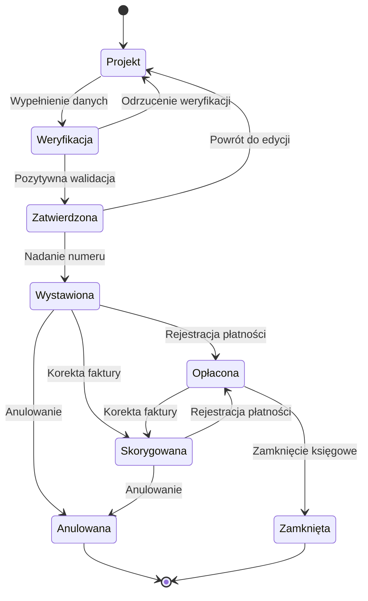

### Metodologia testowania automatycznego dla modułu Faktur

Moje podejście do automatyzacji testów modułu faktur opiera się na solidnym procesie, który zapewnia wysoką jakość i skuteczność testowania. Poniżej opisuję mój typowy proces:

#### **1. Testowanie manualne jako podstawa**

Zanim przystąpię do automatyzacji, zawsze najpierw testuję funkcjonalność manualnie. Pozwala mi to zrozumieć system fakturowania i zidentyfikować potencjalne problemy, które mogą wymagać szczególnej uwagi podczas automatyzacji.

#### **2. Analiza dokumentacji**

- Jeśli dostępna jest dokumentacja (specyfikacja, user stories, przypadki użycia) - analizuję ją dokładnie
- W przypadku braku dokumentacji, stosuję podejście eksploracyjne, aby odkryć wszystkie aspekty modułu faktur

#### **3. Testowanie ścieżek pozytywnych**

Zaczynam od tzw. "happy path" - czyli podstawowej, poprawnej ścieżki użytkownika. Dla faktur obejmuje to pełny cykl życia faktury - od utworzenia, przez zatwierdzenie, wystawienie, aż po opłacenie.

#### **4. Tworzenie scenariuszy testowych**

Na podstawie zdobytej wiedzy tworzę scenariusze testowe dla faktur, które następnie pomagają mi wyodrębnić konkretne przypadki testowe. Przykładowe scenariusze dla faktur:
- Dodawanie nowej faktury
- Edycja faktury w stanie Projekt
- Walidacja wymaganych pól faktury
- Wystawianie faktury
- Anulowanie faktury
- Tworzenie faktury korygującej

#### **5. Testowanie ścieżek negatywnych**

Po przetestowaniu ścieżek pozytywnych, skupiam się na testach negatywnych - sprawdzam jak system reaguje na niepoprawne dane faktur, przekroczenie limitów wartości, czy nietypowe interakcje użytkownika.

#### **6. Zastosowanie technik testowych**

Wykorzystuję różne techniki testowe, takie jak:
- Klasy równoważności - grupowanie danych faktur w kategorie (np. różne typy faktur: VAT, proforma, zaliczkowa)
- Diagramy przejścia stanów - szczególnie przydatne w procesie fakturowania, gdzie faktura przechodzi przez różne stany od projektu do zamknięcia

#### **7. Automatyzacja testów**

Po dokładnej analizie manualnej przystępuję do automatyzacji, która obejmuje:
- Wybór odpowiedniego frameworka testowego - wiadomo Playwright z TS :D
- Implementację skryptów testowych dla różnych scenariuszy fakturowania
- Wykonanie testów i analizę wyników
- Integrację z systemem CI/CD dla ciągłego testowania modułu faktur

Powyższy diagram prezentuje stany i przejścia faktury w systemie, co stanowi podstawę do tworzenia zarówno testów manualnych jak i automatycznych.