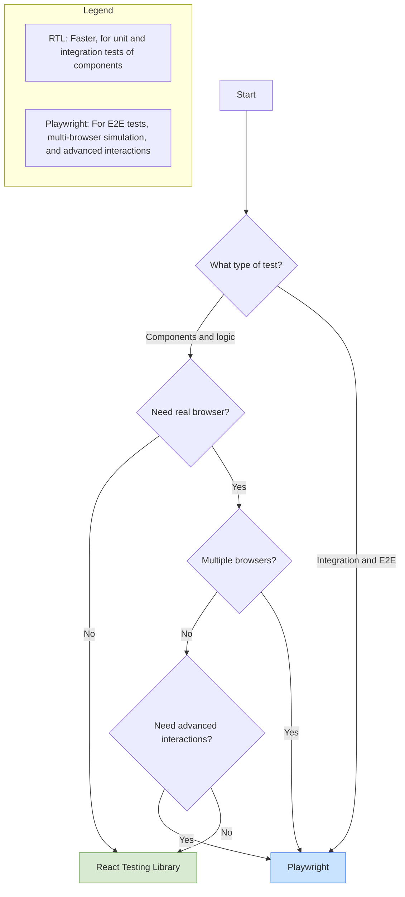

# Testing React Components with Testing Library vs Playwright - What to Choose and When?

## Introduction

Testing frontend applications, especially those built with React, has become one of the key elements in the software development process. Two popular testing libraries - React Testing Library and Playwright - offer different approaches to verifying the correctness of user interfaces. In this article, we will conduct an in-depth analysis of both solutions, highlighting their strengths and weaknesses, and scenarios where they perform best.

## Table of Contents:

1. [Characteristics of the tools](#characteristics-of-the-tools)
2. [Testing philosophy](#testing-philosophy)
3. [Environment configuration](#environment-configuration)
4. [Basic test cases](#basic-test-cases)
5. [User interaction testing](#user-interaction-testing)
6. [Asynchronous testing](#asynchronous-testing)
7. [Mocking and test isolation](#mocking-and-test-isolation)
8. [Debugging tests](#debugging-tests)
9. [Performance and scalability](#performance-and-scalability)
10. [CI/CD integration](#cicd-integration)
11. [Comparison based on real scenarios](#comparison-based-on-real-scenarios)
12. [Summary and recommendations](#summary-and-recommendations)

## Characteristics of the tools

### React Testing Library

React Testing Library (RTL) is part of a larger family of Testing Library libraries, designed to test UI components in a way that reflects real user experiences. RTL emphasizes testing what the user sees and interacts with, rather than focusing on the internal implementation of components.

```javascript
// Basic test example with React Testing Library
import { render, screen, fireEvent } from '@testing-library/react';
import Counter from './Counter';

test('increment counter after click', () => {
  render(<Counter />);
  
  // Find elements based on text/role
  const counter = screen.getByText(/counter: 0/i);
  const incrementButton = screen.getByRole('button', { name: /increment/i });
  
  // Simulate a click
  fireEvent.click(incrementButton);
  
  // Check if the state has changed
  expect(screen.getByText(/counter: 1/i)).toBeInTheDocument();
});
```

### Playwright

Playwright is a browser automation framework that enables end-to-end (E2E) testing of web applications across multiple browsers (Chromium, Firefox, WebKit). Although Playwright is primarily an E2E testing tool, it can also be used to test React components using `@playwright/experimental-ct-react`.

```javascript
// Basic test example with Playwright for a component
import { test, expect } from '@playwright/experimental-ct-react';
import Counter from './Counter';

test('increment counter after click', async ({ mount }) => {
  // Render the component
  const component = await mount(<Counter />);
  
  // Check the initial state
  await expect(component.getByText(/counter: 0/i)).toBeVisible();
  
  // Click the button
  await component.getByRole('button', { name: /increment/i }).click();
  
  // Check if the state has changed
  await expect(component.getByText(/counter: 1/i)).toBeVisible();
});
```

## Testing philosophy

| Aspect | React Testing Library | Playwright |
|--------|------------------------|------------|
| Testing level | Mainly unit and integration tests | Mainly E2E tests, with component testing capabilities |
| Approach | "Testing Library Way": test behavior, not implementation | "Browser First": test like a real browser |
| Selectors | Prefers accessible attributes (roles, labels, text) | Offers multiple element selection strategies (CSS, XPath, text) |
| Isolation | Tests components in isolation or shallow integrations | Tests entire applications or components in a browser context |
| Focus | On behavior accessible to the user | On full functionality available in the browser |

## Environment configuration

### React Testing Library Configuration

```javascript
// package.json
{
  "dependencies": {
    "react": "^18.2.0",
    "react-dom": "^18.2.0"
  },
  "devDependencies": {
    "@testing-library/jest-dom": "^6.1.4",
    "@testing-library/react": "^14.0.0",
    "@testing-library/user-event": "^14.5.1",
    "jest": "^29.7.0",
    "jest-environment-jsdom": "^29.7.0"
  }
}
```

```javascript
// jest.config.js
module.exports = {
  testEnvironment: 'jsdom',
  setupFilesAfterEnv: ['./jest.setup.js'],
  transform: {
    '^.+\\.(js|jsx|ts|tsx)$': 'babel-jest',
  },
};
```

```javascript
// jest.setup.js
import '@testing-library/jest-dom';
```

### Playwright Configuration for Component Testing

```javascript
// package.json
{
  "dependencies": {
    "react": "^18.2.0",
    "react-dom": "^18.2.0"
  },
  "devDependencies": {
    "@playwright/experimental-ct-react": "^1.40.0",
    "@playwright/test": "^1.40.0"
  }
}
```

```javascript
// playwright-ct.config.ts
import { defineConfig } from '@playwright/experimental-ct-react';
import { resolve } from 'path';

export default defineConfig({
  testDir: './tests',
  use: {
    ctPort: 3100,
    ctViteConfig: {
      resolve: {
        alias: {
          '@': resolve(__dirname, './src'),
        },
      },
    },
  },
  projects: [
    {
      name: 'chromium',
      use: { browserName: 'chromium' },
    },
    {
      name: 'firefox',
      use: { browserName: 'firefox' },
    },
    {
      name: 'webkit',
      use: { browserName: 'webkit' },
    },
  ],
});
```

```typescript
// playwright/index.html
<!DOCTYPE html>
<html lang="en">
<head>
  <meta charset="UTF-8">
  <meta name="viewport" content="width=device-width, initial-scale=1.0">
  <title>Testing with Playwright</title>
</head>
<body>
  <div id="root"></div>
  <script type="module" src="./index.tsx"></script>
</body>
</html>
```

## Basic test cases

### React Testing Library

```javascript
// Testing component rendering
import { render, screen } from '@testing-library/react';
import UserProfile from './UserProfile';

test('displays user data correctly', () => {
  const user = {
    name: 'John Smith',
    email: 'john@example.com',
    role: 'Developer'
  };
  
  render(<UserProfile user={user} />);
  
  expect(screen.getByText('John Smith')).toBeInTheDocument();
  expect(screen.getByText('john@example.com')).toBeInTheDocument();
  expect(screen.getByText('Developer')).toBeInTheDocument();
});

// Testing conditional rendering
test('displays a message when no user data is available', () => {
  render(<UserProfile />);
  
  expect(screen.getByText(/no user data available/i)).toBeInTheDocument();
});
```

### Playwright

```javascript
// Testing component rendering
import { test, expect } from '@playwright/experimental-ct-react';
import UserProfile from './UserProfile';

test('displays user data correctly', async ({ mount }) => {
  const user = {
    name: 'John Smith',
    email: 'john@example.com',
    role: 'Developer'
  };
  
  const component = await mount(<UserProfile user={user} />);
  
  await expect(component.getByText('John Smith')).toBeVisible();
  await expect(component.getByText('john@example.com')).toBeVisible();
  await expect(component.getByText('Developer')).toBeVisible();
});

// Testing conditional rendering
test('displays a message when no user data is available', async ({ mount }) => {
  const component = await mount(<UserProfile />);
  
  await expect(component.getByText(/no user data available/i)).toBeVisible();
});
```

## User interaction testing

### React Testing Library with user-event

```javascript
// Testing a login form
import { render, screen } from '@testing-library/react';
import userEvent from '@testing-library/user-event';
import LoginForm from './LoginForm';

test('calls onSubmit with login data after button click', async () => {
  const mockSubmit = jest.fn();
  render(<LoginForm onSubmit={mockSubmit} />);
  
  // Find form fields
  const emailInput = screen.getByLabelText(/email/i);
  const passwordInput = screen.getByLabelText(/password/i);
  const submitButton = screen.getByRole('button', { name: /log in/i });
  
  // Type data
  await userEvent.type(emailInput, 'test@example.com');
  await userEvent.type(passwordInput, 'password123');
  
  // Click the button
  await userEvent.click(submitButton);
  
  // Check if the function was called with the right arguments
  expect(mockSubmit).toHaveBeenCalledWith({
    email: 'test@example.com',
    password: 'password123'
  });
});
```

### Playwright

```javascript
// Testing a login form
import { test, expect } from '@playwright/experimental-ct-react';
import LoginForm from './LoginForm';

test('calls onSubmit with login data after button click', async ({ mount }) => {
  const onSubmitMock = { submit: ({ email, password }) => {} };
  const submitSpy = test.spyOn(onSubmitMock, 'submit');
  
  const component = await mount(
    <LoginForm onSubmit={onSubmitMock.submit} />
  );
  
  // Type data
  await component.getByLabel(/email/i).fill('test@example.com');
  await component.getByLabel(/password/i).fill('password123');
  
  // Click the button
  await component.getByRole('button', { name: /log in/i }).click();
  
  // Check if the function was called with the right arguments
  expect(submitSpy).toHaveBeenCalledWith({
    email: 'test@example.com',
    password: 'password123'
  });
});
```

## Asynchronous testing

### React Testing Library

```javascript
// Testing data loading
import { render, screen, waitFor } from '@testing-library/react';
import UserList from './UserList';
import { fetchUsers } from './api';

// Mocking the API module
jest.mock('./api');

test('displays user list after loading', async () => {
  // Prepare the mock
  fetchUsers.mockResolvedValueOnce([
    { id: 1, name: 'John Smith' },
    { id: 2, name: 'Jane Doe' }
  ]);
  
  render(<UserList />);
  
  // Check if the loader is displayed
  expect(screen.getByText(/loading/i)).toBeInTheDocument();
  
  // Wait for the data
  await waitFor(() => {
    expect(screen.getByText('John Smith')).toBeInTheDocument();
    expect(screen.getByText('Jane Doe')).toBeInTheDocument();
    expect(screen.queryByText(/loading/i)).not.toBeInTheDocument();
  });
});
```

### Playwright

```javascript
// Testing data loading
import { test, expect } from '@playwright/experimental-ct-react';
import { MockedApiProvider } from './test-utils';
import UserList from './UserList';

test('displays user list after loading', async ({ mount }) => {
  // Data for the mock
  const mockUsers = [
    { id: 1, name: 'John Smith' },
    { id: 2, name: 'Jane Doe' }
  ];
  
  // Render the component with a mock provider
  const component = await mount(
    <MockedApiProvider
      mocks={{
        fetchUsers: async () => mockUsers
      }}
    >
      <UserList />
    </MockedApiProvider>
  );
  
  // Check if the loader is displayed
  await expect(component.getByText(/loading/i)).toBeVisible();
  
  // Wait for the data
  await expect(component.getByText('John Smith')).toBeVisible();
  await expect(component.getByText('Jane Doe')).toBeVisible();
  
  // Check if the loader disappeared
  await expect(component.getByText(/loading/i)).not.toBeVisible();
});
```

## Mocking and test isolation

### React Testing Library

```javascript
// Mocking React context
import { render, screen, fireEvent } from '@testing-library/react';
import { ThemeContext } from './ThemeContext';
import ThemeSwitcher from './ThemeSwitcher';

test('toggles theme', () => {
  const mockSetTheme = jest.fn();
  
  render(
    <ThemeContext.Provider value={{ theme: 'light', setTheme: mockSetTheme }}>
      <ThemeSwitcher />
    </ThemeContext.Provider>
  );
  
  // Click the switch button
  fireEvent.click(screen.getByRole('button', { name: /change theme/i }));
  
  // Click the switch button
  fireEvent.click(screen.getByRole('button', { name: /change theme/i }));
  
  // Check if the function was called with the right argument
  expect(mockSetTheme).toHaveBeenCalledWith('dark');
});

// Mocking modules
import { render, screen } from '@testing-library/react';
import userEvent from '@testing-library/user-event';
import WeatherWidget from './WeatherWidget';
import { getWeather } from './weatherService';

// Mocking the weather service module
jest.mock('./weatherService');

test('displays weather information after searching for a city', async () => {
  // Set up the mock
  getWeather.mockResolvedValueOnce({
    temperature: 21,
    conditions: 'Sunny',
    humidity: 45
  });
  
  render(<WeatherWidget />);
  
  // Enter the city name
  await userEvent.type(screen.getByLabelText(/city/i), 'London');
  
  // Click the search button
  await userEvent.click(screen.getByRole('button', { name: /check/i }));
  
  // Wait for results
  expect(await screen.findByText(/temperature: 21°C/i)).toBeInTheDocument();
  expect(screen.getByText(/conditions: sunny/i)).toBeInTheDocument();
  expect(screen.getByText(/humidity: 45%/i)).toBeInTheDocument();
  
  // Check if the service was called with the right argument
  expect(getWeather).toHaveBeenCalledWith('London');
});
```

### Playwright

```javascript
// Mocking React context
import { test, expect } from '@playwright/experimental-ct-react';
import { ThemeContext } from './ThemeContext';
import ThemeSwitcher from './ThemeSwitcher';

test('toggles theme', async ({ mount }) => {
  const mockContextValue = {
    theme: 'light',
    setTheme: test.fn()
  };
  
  const component = await mount(
    <ThemeContext.Provider value={mockContextValue}>
      <ThemeSwitcher />
    </ThemeContext.Provider>
  );
  
  // Click the switch button
  await component.getByRole('button', { name: /change theme/i }).click();
  
  // Check if the function was called with the right argument
  expect(mockContextValue.setTheme).toHaveBeenCalledWith('dark');
});

// Mocking HTTP requests
import { test, expect } from '@playwright/experimental-ct-react';
import WeatherWidget from './WeatherWidget';

test('displays weather information after searching for a city', async ({ mount, page }) => {
  // Prepare the mock for the API
  await page.route('**/api/weather?city=**', route => {
    route.fulfill({
      status: 200,
      contentType: 'application/json',
      body: JSON.stringify({
        temperature: 21,
        conditions: 'Sunny',
        humidity: 45
      })
    });
  });
  
  const component = await mount(<WeatherWidget />);
  
  // Enter the city name
  await component.getByLabel(/city/i).fill('London');
  
  // Click the search button
  await component.getByRole('button', { name: /check/i }).click();
  
  // Wait for results
  await expect(component.getByText(/temperature: 21°C/i)).toBeVisible();
  await expect(component.getByText(/conditions: sunny/i)).toBeVisible();
  await expect(component.getByText(/humidity: 45%/i)).toBeVisible();
});
```

## Debugging tests

### React Testing Library

```javascript
// Debugging tests
import { render, screen } from '@testing-library/react';
import ComplexComponent from './ComplexComponent';

test('renders complex component', () => {
  render(<ComplexComponent />);
  
  // Display DOM structure to the console
  screen.debug();
  
  // Display a specific element
  const header = screen.getByRole('heading', { name: /title/i });
  screen.debug(header);
  
  // Log available elements and their roles
  console.log(screen.logTestingPlaygroundURL());
});
```

### Playwright

```javascript
// Debugging tests
import { test, expect } from '@playwright/experimental-ct-react';
import ComplexComponent from './ComplexComponent';

test('renders complex component', async ({ mount, page }) => {
  const component = await mount(<ComplexComponent />);
  
  // Capture a screenshot
  await page.screenshot({ path: 'screenshot.png' });
  
  // Enable debug mode
  await page.pause();
  
  // Accessibility inspection
  const snapshot = await page.accessibility.snapshot();
  console.log(JSON.stringify(snapshot, null, 2));
  
  // Check the DOM structure
  const html = await page.content();
  console.log(html);
});
```

## Debugging tools

| Tool | React Testing Library | Playwright |
|-----------|------------------------|------------|
| DOM preview | `screen.debug()` | `page.content()` |
| Screenshots | Not natively supported | `page.screenshot()` |
| Accessibility inspection | `logRoles()` | `page.accessibility.snapshot()` |
| Interactive debugging | Through IDE breakpoints | `page.pause()` |
| Video recording | Not natively supported | `recordVideo` in configuration |
| Console inspection | `jest.spyOn(console, 'error')` | `page.on('console')` |

## Performance and scalability

### Performance comparison

| Aspect | React Testing Library | Playwright |
|--------|------------------------|------------|
| Startup time | Fast - runs in Node.js environment | Slower - requires browser launch |
| Memory | Low usage | Higher usage due to the browser |
| Parallelism | Supported by Jest | Built-in sharding support |
| Test isolation | Isolated by default | Possible state sharing between tests |
| Handling large test suites | Good, but may require configuration | Very good, with built-in tools |

### Optimization examples

```javascript
// RTL optimization - reuse rendering
import { render, screen } from '@testing-library/react';
import userEvent from '@testing-library/user-event';
import Counter from './Counter';

describe('Counter', () => {
  const user = userEvent.setup();
  
  beforeEach(() => {
    render(<Counter />);
  });
  
  test('shows initial value', () => {
    expect(screen.getByText(/counter: 0/i)).toBeInTheDocument();
  });
  
  test('increases value after click', async () => {
    await user.click(screen.getByRole('button', { name: /increment/i }));
    expect(screen.getByText(/counter: 1/i)).toBeInTheDocument();
  });
});
```

```javascript
// Playwright optimization - state sharing
import { test, expect } from '@playwright/experimental-ct-react';
import ComplexApp from './ComplexApp';

// Perform expensive operations only once
test.beforeAll(async ({ browser }) => {
  const page = await browser.newPage();
  await page.goto('http://localhost:3000');
  await page.evaluate(() => localStorage.setItem('token', 'test-token'));
  await page.context().storageState({ path: 'state.json' });
  await page.close();
});

// Use saved state
test.use({
  storageState: 'state.json',
});

test('renders app with saved state', async ({ mount }) => {
  const component = await mount(<ComplexApp />);
  await expect(component.getByText(/logged in/i)).toBeVisible();
});
```

## CI/CD integration

### React Testing Library in CI/CD

```yaml
# .github/workflows/react-testing-library.yml
name: RTL Tests

on:
  push:
    branches: [ main ]
  pull_request:
    branches: [ main ]

jobs:
  test:
    runs-on: ubuntu-latest
    steps:
      - uses: actions/checkout@v3
      - name: Use Node.js
        uses: actions/setup-node@v3
        with:
          node-version: '18.x'
          cache: 'npm'
      - run: npm ci
      - run: npm test
      - name: Upload test results
        uses: actions/upload-artifact@v3
        with:
          name: test-results
          path: coverage/
```

### Playwright in CI/CD

```yaml
# .github/workflows/playwright.yml
name: Playwright Tests

on:
  push:
    branches: [ main ]
  pull_request:
    branches: [ main ]

jobs:
  test:
    timeout-minutes: 30
    runs-on: ubuntu-latest
    steps:
      - uses: actions/checkout@v3
      - name: Use Node.js
        uses: actions/setup-node@v3
        with:
          node-version: '18.x'
          cache: 'npm'
      - run: npm ci
      - run: npx playwright install --with-deps
      - run: npm run test:ct
      - name: Upload test results
        uses: actions/upload-artifact@v3
        if: always()
        with:
          name: playwright-report
          path: playwright-report/
```

## Comparison based on real scenarios

### Scenario 1: Testing a form with validation

```javascript
// FormWithValidation component
import React, { useState } from 'react';

const FormWithValidation = ({ onSubmit }) => {
  const [formData, setFormData] = useState({
    name: '',
    email: '',
    password: ''
  });
  const [errors, setErrors] = useState({});
  
  const validate = () => {
    const newErrors = {};
    if (!formData.name) newErrors.name = 'Name is required';
    if (!formData.email) newErrors.email = 'Email is required';
    if (!formData.email.includes('@')) newErrors.email = 'Invalid email format';
    if (formData.password.length < 8) newErrors.password = 'Password must be at least 8 characters';
    return newErrors;
  };
  
  const handleChange = (e) => {
    const { name, value } = e.target;
    setFormData(prev => ({ ...prev, [name]: value }));
  };
  
  const handleSubmit = (e) => {
    e.preventDefault();
    const newErrors = validate();
    if (Object.keys(newErrors).length === 0) {
      onSubmit(formData);
    } else {
      setErrors(newErrors);
    }
  };
  
  return (
    <form onSubmit={handleSubmit} noValidate>
      <div>
        <label htmlFor="name">Name:</label>
        <input
          id="name"
          name="name"
          value={formData.name}
          onChange={handleChange}
          aria-invalid={!!errors.name}
        />
        {errors.name && <p role="alert">{errors.name}</p>}
      </div>
      
      <div>
        <label htmlFor="email">Email:</label>
        <input
          id="email"
          name="email"
          type="email"
          value={formData.email}
          onChange={handleChange}
          aria-invalid={!!errors.email}
        />
        {errors.email && <p role="alert">{errors.email}</p>}
      </div>
      
      <div>
        <label htmlFor="password">Password:</label>
        <input
          id="password"
          name="password"
          type="password"
          value={formData.password}
          onChange={handleChange}
          aria-invalid={!!errors.password}
        />
        {errors.password && <p role="alert">{errors.password}</p>}
      </div>
      
      <button type="submit">Save</button>
    </form>
  );
};

export default FormWithValidation;
```

#### React Testing Library

```javascript
// Test form with validation - RTL
import { render, screen } from '@testing-library/react';
import userEvent from '@testing-library/user-event';
import FormWithValidation from './FormWithValidation';

describe('FormWithValidation', () => {
  test('displays validation errors for empty fields', async () => {
    const user = userEvent.setup();
    const handleSubmit = jest.fn();
    
    render(<FormWithValidation onSubmit={handleSubmit} />);
    
    // Click the submit button without filling in the fields
    await user.click(screen.getByRole('button', { name: /save/i }));
    
    // Check if error messages are displayed
    expect(screen.getByText(/name is required/i)).toBeInTheDocument();
    expect(screen.getByText(/email is required/i)).toBeInTheDocument();
    expect(screen.getByText(/password must be at least 8 characters/i)).toBeInTheDocument();
    
    // Check if the onSubmit function was not called
    expect(handleSubmit).not.toHaveBeenCalled();
  });
  
  test('submits the form with valid data', async () => {
    const user = userEvent.setup();
    const handleSubmit = jest.fn();
    
    render(<FormWithValidation onSubmit={handleSubmit} />);
    
    // Fill the form with valid data
    await user.type(screen.getByLabelText(/name/i), 'John Smith');
    await user.type(screen.getByLabelText(/email/i), 'john@example.com');
    await user.type(screen.getByLabelText(/password/i), 'password123');
    
    // Click the submit button
    await user.click(screen.getByRole('button', { name: /save/i }));

    // Check if the onSubmit function was called with the correct data
    expect(handleSubmit).toHaveBeenCalledWith({
      name: 'John Smith',
      email: 'john@example.com',
      password: 'password123'
    });
  });
  
  test('displays error with invalid email format', async () => {
    const user = userEvent.setup();
    const handleSubmit = jest.fn();
    
    render(<FormWithValidation onSubmit={handleSubmit} />);
    
    // Fill the form with an invalid email
    await user.type(screen.getByLabelText(/name/i), 'John Smith');
    await user.type(screen.getByLabelText(/email/i), 'invalid-email');
    await user.type(screen.getByLabelText(/password/i), 'password123');
    
    // Click the submit button
    await user.click(screen.getByRole('button', { name: /save/i }));
    
    // Check if the error message is displayed
    expect(screen.getByText(/invalid email format/i)).toBeInTheDocument();
    
    // Check if the onSubmit function was not called
    expect(handleSubmit).not.toHaveBeenCalled();
  });
});
```

#### Playwright

```javascript
// Test form with validation - Playwright
import { test, expect } from '@playwright/experimental-ct-react';
import FormWithValidation from './FormWithValidation';

test.describe('FormWithValidation', () => {
  test('displays validation errors for empty fields', async ({ mount }) => {
    const onSubmitMock = { submit: (data) => {} };
    const submitSpy = test.spyOn(onSubmitMock, 'submit');
    
    const component = await mount(<FormWithValidation onSubmit={onSubmitMock.submit} />);
    
    // Click the submit button without filling in the fields
    await component.getByRole('button', { name: /save/i }).click();
    
    // Check if error messages are displayed
    await expect(component.getByText(/name is required/i)).toBeVisible();
    await expect(component.getByText(/email is required/i)).toBeVisible();
    await expect(component.getByText(/password must be at least 8 characters/i)).toBeVisible();
    
    // Check if the onSubmit function was not called
    expect(submitSpy).not.toHaveBeenCalled();
  });
  
  test('submits the form with valid data', async ({ mount }) => {
    const onSubmitMock = { submit: (data) => {} };
    const submitSpy = test.spyOn(onSubmitMock, 'submit');
    
    const component = await mount(<FormWithValidation onSubmit={onSubmitMock.submit} />);
    
    // Fill the form with valid data
    await component.getByLabel(/name/i).fill('John Smith');
    await component.getByLabel(/email/i).fill('john@example.com');
    await component.getByLabel(/password/i).fill('password123');
    
    // Click the submit button
    await component.getByRole('button', { name: /save/i }).click();
    
    // Check if the onSubmit function was called with the correct data
    expect(submitSpy).toHaveBeenCalledWith({
      name: 'John Smith',
      email: 'john@example.com',
      password: 'password123'
    });
  });
  
  test('displays error with invalid email format', async ({ mount }) => {
    const onSubmitMock = { submit: (data) => {} };
    const submitSpy = test.spyOn(onSubmitMock, 'submit');
    
    const component = await mount(<FormWithValidation onSubmit={onSubmitMock.submit} />);
    
    // Fill the form with an invalid email
    await component.getByLabel(/name/i).fill('John Smith');
    await component.getByLabel(/email/i).fill('invalid-email');
    await component.getByLabel(/password/i).fill('password123');
    
    // Click the submit button
    await component.getByRole('button', { name: /save/i }).click();
    
    // Check if the error message is displayed
    await expect(component.getByText(/invalid email format/i)).toBeVisible();
    
    // Check if the onSubmit function was not called
    expect(submitSpy).not.toHaveBeenCalled();
  });
});
```

### Scenario 2: Testing a component with asynchronous data loading

```javascript
// DataFetcher component
import React, { useState, useEffect } from 'react';

const DataFetcher = ({ url, renderItem }) => {
  const [data, setData] = useState([]);
  const [loading, setLoading] = useState(true);
  const [error, setError] = useState(null);
  
  useEffect(() => {
    let isMounted = true;
    
    const fetchData = async () => {
      try {
        setLoading(true);
        const response = await fetch(url);
        
        if (!response.ok) {
          throw new Error(`HTTP error! status: ${response.status}`);
        }
        
        const result = await response.json();
        
        if (isMounted) {
          setData(result);
          setError(null);
        }
      } catch (err) {
        if (isMounted) {
          setError(err.message);
        }
      } finally {
        if (isMounted) {
          setLoading(false);
        }
      }
    };
    
    fetchData();
    
    return () => {
      isMounted = false;
    };
  }, [url]);
  
  if (loading) {
    return <div data-testid="loading">Loading data...</div>;
  }
  
  if (error) {
    return <div data-testid="error">Error: {error}</div>;
  }
  
  if (data.length === 0) {
    return <div data-testid="empty">No data available</div>;
  }
  
  return (
    <ul data-testid="data-list">
      {data.map((item, index) => (
        <li key={index}>{renderItem(item)}</li>
      ))}
    </ul>
  );
};

export default DataFetcher;
```

#### React Testing Library

```javascript
// Test component with asynchronous data loading - RTL
import { render, screen, waitForElementToBeRemoved } from '@testing-library/react';
import DataFetcher from './DataFetcher';

// Mock global functions
global.fetch = jest.fn();

describe('DataFetcher', () => {
  beforeEach(() => {
    global.fetch.mockClear();
  });
  
  test('displays loading state, then data', async () => {
    // Prepare the mock
    global.fetch.mockResolvedValueOnce({
      ok: true,
      json: async () => ([{ name: 'Item 1' }, { name: 'Item 2' }])
    });
    
    render(
      <DataFetcher 
        url="/api/data" 
        renderItem={(item) => item.name}
      />
    );
    
    // Check if loading state is displayed
    expect(screen.getByTestId('loading')).toBeInTheDocument();
    
    // Wait for loading to complete
    await waitForElementToBeRemoved(() => screen.queryByTestId('loading'));
    
    // Check if data is displayed
    expect(screen.getByTestId('data-list')).toBeInTheDocument();
    expect(screen.getByText('Item 1')).toBeInTheDocument();
    expect(screen.getByText('Item 2')).toBeInTheDocument();
    
    // Check if fetch was called with the correct URL
    expect(global.fetch).toHaveBeenCalledWith('/api/data');
  });
  
  test('handles error during data loading', async () => {
    // Prepare mock with error
    global.fetch.mockResolvedValueOnce({
      ok: false,
      status: 500
    });
    
    render(
      <DataFetcher 
        url="/api/data" 
        renderItem={(item) => item.name}
      />
    );
    
    // Wait for loading to complete
    await waitForElementToBeRemoved(() => screen.queryByTestId('loading'));
    
    // Check if error is displayed
    expect(screen.getByTestId('error')).toBeInTheDocument();
    expect(screen.getByText(/HTTP error! status: 500/i)).toBeInTheDocument();
  });
  
  test('handles empty data list', async () => {
    // Prepare mock with empty array
    global.fetch.mockResolvedValueOnce({
      ok: true,
      json: async () => ([])
    });
    
    render(
      <DataFetcher 
        url="/api/data" 
        renderItem={(item) => item.name}
      />
    );
    
    // Wait for loading to complete
    await waitForElementToBeRemoved(() => screen.queryByTestId('loading'));
    
    // Check if empty data message is displayed
    expect(screen.getByTestId('empty')).toBeInTheDocument();
    expect(screen.getByText(/no data available/i)).toBeInTheDocument();
  });
});
```

#### Playwright

```javascript
// Test component with asynchronous data loading - Playwright
import { test, expect } from '@playwright/experimental-ct-react';
import DataFetcher from './DataFetcher';

test.describe('DataFetcher', () => {
  test('displays loading state, then data', async ({ mount, page }) => {
    // Mock API response
    await page.route('**/api/data', route => {
      route.fulfill({
        status: 200,
        contentType: 'application/json',
        body: JSON.stringify([{ name: 'Item 1' }, { name: 'Item 2' }])
      });
    });
    
    const component = await mount(
      <DataFetcher 
        url="/api/data" 
        renderItem={(item) => item.name}
      />
    );
    
    // Check if loading state is displayed
    await expect(component.getByTestId('loading')).toBeVisible();
    
    // Wait for loading to complete and check results
    await expect(component.getByTestId('loading')).not.toBeVisible();
    await expect(component.getByTestId('data-list')).toBeVisible();
    await expect(component.getByText('Item 1')).toBeVisible();
    await expect(component.getByText('Item 2')).toBeVisible();
  });
  
  test('handles error during data loading', async ({ mount, page }) => {
    // Mock API error
    await page.route('**/api/data', route => {
      route.fulfill({
        status: 500,
        contentType: 'application/json',
        body: JSON.stringify({ error: 'Internal Server Error' })
      });
    });
    
    const component = await mount(
      <DataFetcher 
        url="/api/data" 
        renderItem={(item) => item.name}
      />
    );
    
    // Wait for loading to complete and check error
    await expect(component.getByTestId('loading')).not.toBeVisible();
    await expect(component.getByTestId('error')).toBeVisible();
    await expect(component.getByText(/HTTP error! status: 500/i)).toBeVisible();
  });
  
  test('handles empty data list', async ({ mount, page }) => {
    // Mock empty API response
    await page.route('**/api/data', route => {
      route.fulfill({
        status: 200,
        contentType: 'application/json',
        body: JSON.stringify([])
      });
    });
    
    const component = await mount(
      <DataFetcher 
        url="/api/data" 
        renderItem={(item) => item.name}
      />
    );
    
    // Wait for loading to complete and check empty data message
    await expect(component.getByTestId('loading')).not.toBeVisible();
    await expect(component.getByTestId('empty')).toBeVisible();
    await expect(component.getByText(/no data available/i)).toBeVisible();
  });
});
```

# Summary and recommendations

Both React Testing Library (RTL) and Playwright offer robust solutions for testing React applications, though each has its optimal use cases. Below is a comprehensive summary and recommendations for choosing the right tool.

## Decision flow diagram



## Comparison table

| Aspect | React Testing Library | Playwright |
|--------|----------------------|------------|
| Test type | Unit, integration | Integration, E2E, component |
| Runtime environment | JSDOM (DOM simulation) | Real browsers |
| Browser support | Simulation in JSDOM | Chrome, Firefox, Safari, Edge |
| Configuration complexity | Low | Medium |
| Execution speed | High | Medium |
| Debugging | Good | Very good |
| Dependency mocking | Easy (in JS environment) | More complex |
| User interactions | Basic to intermediate | Advanced and comprehensive |
| Visual testing | Limited | Extensive (screenshots, comparisons) |
| Performance with large test suites | Very good | Good |
| CI/CD integration | Simple | Requires additional configuration |
| Learning curve | Flat | Steeper |

## When to choose React Testing Library:

1. **Component testing**: When the main goal is to test isolated React components.
2. **Fast tests**: When execution speed is crucial and you want the fastest feedback loop.
3. **Unit and integration tests**: When focusing on business logic verification and basic user interactions.
4. **Configuration simplicity**: For teams that need to implement tests quickly without complex configuration.
5. **Small and medium projects**: Particularly effective in projects where the component architecture is well-defined.

## When to choose Playwright:

1. **E2E tests**: When you need to test the entire user flow from beginning to end.
2. **Multi-browser testing**: When you need to ensure compatibility across different browsers.
3. **Advanced interactions**: When testing complex user interactions that require precise browser control.
4. **Visual testing**: When you need to compare the appearance of the user interface.
5. **Large projects and cross-platform applications**: For comprehensive projects with multiple user flows.

## Best practices:

1. **Hybrid approach**: In most projects, a combination of both tools works best - RTL for unit and component tests, Playwright for E2E tests.
2. **Test pyramid**: Maintain the classic test pyramid with more unit tests (RTL) and fewer E2E tests (Playwright).
3. **CI/CD automation**: Configure both tools in your CI/CD pipeline to ensure comprehensive verification.
4. **Performance optimization**: For large projects, consider parallel test execution, particularly with Playwright.
5. **Common language**: Regardless of the tool chosen, use a consistent approach to naming and organizing tests.

## Conclusion:

React Testing Library and Playwright are not competing tools, but rather complementary solutions in the React testing ecosystem. RTL excels at testing components and their logic, providing fast execution and simple configuration. Playwright, on the other hand, offers a comprehensive solution for E2E tests with advanced browser control features.

The choice of the right tool should be dictated by the project context, testing requirements, and team resources. In an ideal scenario, a testing strategy should include both component tests with RTL and E2E tests with Playwright, creating a solid foundation for ensuring React application quality.