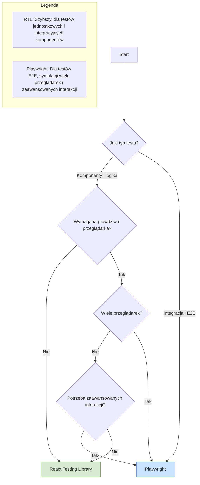

# Testowanie komponentów React z Testing Library vs Playwright - co wybrać i kiedy?

## Wprowadzenie

Testowanie front-endu, a w szczególności aplikacji zbudowanych w React, stało się jednym z kluczowych elementów procesu wytwarzania oprogramowania. Dwie popularne biblioteki testowe - React Testing Library oraz Playwright - oferują różne podejścia do weryfikacji poprawności działania interfejsu użytkownika. W tym artykule przeprowadzimy dogłębną analizę obu rozwiązań, wskazując ich mocne i słabe strony oraz scenariusze, w których sprawdzają się najlepiej.

## Spis treści:

1. [Charakterystyka narzędzi](#charakterystyka-narzędzi)
2. [Filozofia testowania](#filozofia-testowania)
3. [Konfiguracja środowiska](#konfiguracja-środowiska)
4. [Podstawowe przypadki testowe](#podstawowe-przypadki-testowe)
5. [Testowanie interakcji użytkownika](#testowanie-interakcji-użytkownika)
6. [Testowanie asynchroniczne](#testowanie-asynchroniczne)
7. [Mockowanie i izolacja testów](#mockowanie-i-izolacja-testów)
8. [Debugowanie testów](#debugowanie-testów)
9. [Wydajność i skalowalność](#wydajność-i-skalowalność)
10. [Integracja z CI/CD](#integracja-z-cicd)
11. [Porównanie na podstawie realnych scenariuszy](#porównanie-na-podstawie-realnych-scenariuszy)
12. [Podsumowanie i rekomendacje](#podsumowanie-i-rekomendacje)

## Charakterystyka narzędzi

### React Testing Library

React Testing Library (RTL) jest częścią większej rodziny bibliotek Testing Library, zaprojektowanych do testowania komponentów UI w sposób, który odzwierciedla rzeczywiste doświadczenia użytkownika. RTL kładzie nacisk na testowanie tego, co użytkownik widzi i z czym wchodzi w interakcję, zamiast koncentrować się na wewnętrznej implementacji komponentów.

```javascript
// Przykład podstawowego testu z React Testing Library
import { render, screen, fireEvent } from '@testing-library/react';
import Counter from './Counter';

test('inkrementacja licznika po kliknięciu', () => {
  render(<Counter />);
  
  // Znajdujemy elementy na podstawie tekstu/roli
  const counter = screen.getByText(/licznik: 0/i);
  const incrementButton = screen.getByRole('button', { name: /zwiększ/i });
  
  // Symulujemy kliknięcie
  fireEvent.click(incrementButton);
  
  // Sprawdzamy czy stan się zmienił
  expect(screen.getByText(/licznik: 1/i)).toBeInTheDocument();
});
```

### Playwright

Playwright to framework do automatyzacji przeglądarek, który umożliwia testowanie end-to-end (E2E) aplikacji webowych w wielu przeglądarkach (Chromium, Firefox, WebKit). Chociaż Playwright jest głównie narzędziem do testów E2E, można go również wykorzystać do testowania komponentów React z użyciem `@playwright/experimental-ct-react`.

```javascript
// Przykład podstawowego testu z Playwright dla komponentu
import { test, expect } from '@playwright/experimental-ct-react';
import Counter from './Counter';

test('inkrementacja licznika po kliknięciu', async ({ mount }) => {
  // Renderujemy komponent
  const component = await mount(<Counter />);
  
  // Sprawdzamy początkowy stan
  await expect(component.getByText(/licznik: 0/i)).toBeVisible();
  
  // Klikamy przycisk
  await component.getByRole('button', { name: /zwiększ/i }).click();
  
  // Sprawdzamy czy stan się zmienił
  await expect(component.getByText(/licznik: 1/i)).toBeVisible();
});
```

## Filozofia testowania

| Aspekt | React Testing Library | Playwright |
|--------|------------------------|------------|
| Poziom testowania | Głównie testy jednostkowe i integracyjne | Głównie testy E2E, z możliwością testowania komponentów |
| Podejście | "Testing Library Way": testuj zachowanie, nie implementację | "Browser First": testuj jak prawdziwa przeglądarka |
| Selektory | Preferuje dostępne atrybuty (role, etykiety, tekst) | Oferuje wiele strategii wyboru elementów (CSS, XPath, tekst) |
| Izolacja | Testuje komponenty w izolacji lub płytkie integracje | Testuje całe aplikacje lub komponenty w kontekście przeglądarki |
| Focus | Na zachowaniu dostępnym dla użytkownika | Na pełnej funkcjonalności dostępnej w przeglądarce |

## Konfiguracja środowiska

### Konfiguracja React Testing Library

```javascript
// package.json
{
  "dependencies": {
    "react": "^18.2.0",
    "react-dom": "^18.2.0"
  },
  "devDependencies": {
    "@testing-library/jest-dom": "^6.1.4",
    "@testing-library/react": "^14.0.0",
    "@testing-library/user-event": "^14.5.1",
    "jest": "^29.7.0",
    "jest-environment-jsdom": "^29.7.0"
  }
}
```

```javascript
// jest.config.js
module.exports = {
  testEnvironment: 'jsdom',
  setupFilesAfterEnv: ['./jest.setup.js'],
  transform: {
    '^.+\\.(js|jsx|ts|tsx)$': 'babel-jest',
  },
};
```

```javascript
// jest.setup.js
import '@testing-library/jest-dom';
```

### Konfiguracja Playwright dla testowania komponentów

```javascript
// package.json
{
  "dependencies": {
    "react": "^18.2.0",
    "react-dom": "^18.2.0"
  },
  "devDependencies": {
    "@playwright/experimental-ct-react": "^1.40.0",
    "@playwright/test": "^1.40.0"
  }
}
```

```javascript
// playwright-ct.config.ts
import { defineConfig } from '@playwright/experimental-ct-react';
import { resolve } from 'path';

export default defineConfig({
  testDir: './tests',
  use: {
    ctPort: 3100,
    ctViteConfig: {
      resolve: {
        alias: {
          '@': resolve(__dirname, './src'),
        },
      },
    },
  },
  projects: [
    {
      name: 'chromium',
      use: { browserName: 'chromium' },
    },
    {
      name: 'firefox',
      use: { browserName: 'firefox' },
    },
    {
      name: 'webkit',
      use: { browserName: 'webkit' },
    },
  ],
});
```

```typescript
// playwright/index.html
<!DOCTYPE html>
<html lang="en">
<head>
  <meta charset="UTF-8">
  <meta name="viewport" content="width=device-width, initial-scale=1.0">
  <title>Testing with Playwright</title>
</head>
<body>
  <div id="root"></div>
  <script type="module" src="./index.tsx"></script>
</body>
</html>
```

## Podstawowe przypadki testowe

### React Testing Library

```javascript
// Testowanie renderowania komponentu
import { render, screen } from '@testing-library/react';
import UserProfile from './UserProfile';

test('wyświetla dane użytkownika poprawnie', () => {
  const user = {
    name: 'Jan Kowalski',
    email: 'jan@example.com',
    role: 'Developer'
  };
  
  render(<UserProfile user={user} />);
  
  expect(screen.getByText('Jan Kowalski')).toBeInTheDocument();
  expect(screen.getByText('jan@example.com')).toBeInTheDocument();
  expect(screen.getByText('Developer')).toBeInTheDocument();
});

// Testowanie warunkowego renderowania
test('wyświetla komunikat, gdy brak danych użytkownika', () => {
  render(<UserProfile />);
  
  expect(screen.getByText(/brak danych użytkownika/i)).toBeInTheDocument();
});
```

### Playwright

```javascript
// Testowanie renderowania komponentu
import { test, expect } from '@playwright/experimental-ct-react';
import UserProfile from './UserProfile';

test('wyświetla dane użytkownika poprawnie', async ({ mount }) => {
  const user = {
    name: 'Jan Kowalski',
    email: 'jan@example.com',
    role: 'Developer'
  };
  
  const component = await mount(<UserProfile user={user} />);
  
  await expect(component.getByText('Jan Kowalski')).toBeVisible();
  await expect(component.getByText('jan@example.com')).toBeVisible();
  await expect(component.getByText('Developer')).toBeVisible();
});

// Testowanie warunkowego renderowania
test('wyświetla komunikat, gdy brak danych użytkownika', async ({ mount }) => {
  const component = await mount(<UserProfile />);
  
  await expect(component.getByText(/brak danych użytkownika/i)).toBeVisible();
});
```

## Testowanie interakcji użytkownika

### React Testing Library z user-event

```javascript
// Testowanie formularza logowania
import { render, screen } from '@testing-library/react';
import userEvent from '@testing-library/user-event';
import LoginForm from './LoginForm';

test('wywołuje onSubmit z danymi logowania po naciśnięciu przycisku', async () => {
  const mockSubmit = jest.fn();
  render(<LoginForm onSubmit={mockSubmit} />);
  
  // Znajdź pola formularza
  const emailInput = screen.getByLabelText(/email/i);
  const passwordInput = screen.getByLabelText(/hasło/i);
  const submitButton = screen.getByRole('button', { name: /zaloguj/i });
  
  // Wpisz dane
  await userEvent.type(emailInput, 'test@example.com');
  await userEvent.type(passwordInput, 'password123');
  
  // Kliknij przycisk
  await userEvent.click(submitButton);
  
  // Sprawdź czy funkcja została wywołana z odpowiednimi argumentami
  expect(mockSubmit).toHaveBeenCalledWith({
    email: 'test@example.com',
    password: 'password123'
  });
});
```

### Playwright

```javascript
// Testowanie formularza logowania
import { test, expect } from '@playwright/experimental-ct-react';
import LoginForm from './LoginForm';

test('wywołuje onSubmit z danymi logowania po naciśnięciu przycisku', async ({ mount }) => {
  const onSubmitMock = { submit: ({ email, password }) => {} };
  const submitSpy = test.spyOn(onSubmitMock, 'submit');
  
  const component = await mount(
    <LoginForm onSubmit={onSubmitMock.submit} />
  );
  
  // Wpisz dane
  await component.getByLabel(/email/i).fill('test@example.com');
  await component.getByLabel(/hasło/i).fill('password123');
  
  // Kliknij przycisk
  await component.getByRole('button', { name: /zaloguj/i }).click();
  
  // Sprawdź czy funkcja została wywołana z odpowiednimi argumentami
  expect(submitSpy).toHaveBeenCalledWith({
    email: 'test@example.com',
    password: 'password123'
  });
});
```

## Testowanie asynchroniczne

### React Testing Library

```javascript
// Testowanie ładowania danych
import { render, screen, waitFor } from '@testing-library/react';
import UserList from './UserList';
import { fetchUsers } from './api';

// Mockowanie modułu API
jest.mock('./api');

test('wyświetla listę użytkowników po załadowaniu', async () => {
  // Przygotowanie mocka
  fetchUsers.mockResolvedValueOnce([
    { id: 1, name: 'Jan Kowalski' },
    { id: 2, name: 'Anna Nowak' }
  ]);
  
  render(<UserList />);
  
  // Sprawdzenie czy loader jest wyświetlany
  expect(screen.getByText(/ładowanie/i)).toBeInTheDocument();
  
  // Czekanie na dane
  await waitFor(() => {
    expect(screen.getByText('Jan Kowalski')).toBeInTheDocument();
    expect(screen.getByText('Anna Nowak')).toBeInTheDocument();
    expect(screen.queryByText(/ładowanie/i)).not.toBeInTheDocument();
  });
});
```

### Playwright

```javascript
// Testowanie ładowania danych
import { test, expect } from '@playwright/experimental-ct-react';
import { MockedApiProvider } from './test-utils';
import UserList from './UserList';

test('wyświetla listę użytkowników po załadowaniu', async ({ mount }) => {
  // Dane do mocka
  const mockUsers = [
    { id: 1, name: 'Jan Kowalski' },
    { id: 2, name: 'Anna Nowak' }
  ];
  
  // Renderowanie komponentu z prowiderem mocka
  const component = await mount(
    <MockedApiProvider
      mocks={{
        fetchUsers: async () => mockUsers
      }}
    >
      <UserList />
    </MockedApiProvider>
  );
  
  // Sprawdzenie czy loader jest wyświetlany
  await expect(component.getByText(/ładowanie/i)).toBeVisible();
  
  // Czekanie na dane
  await expect(component.getByText('Jan Kowalski')).toBeVisible();
  await expect(component.getByText('Anna Nowak')).toBeVisible();
  
  // Sprawdzenie czy loader zniknął
  await expect(component.getByText(/ładowanie/i)).not.toBeVisible();
});
```

## Mockowanie i izolacja testów

### React Testing Library

```javascript
// Mockowanie kontekstu React
import { render, screen, fireEvent } from '@testing-library/react';
import { ThemeContext } from './ThemeContext';
import ThemeSwitcher from './ThemeSwitcher';

test('przełącza motyw', () => {
  const mockSetTheme = jest.fn();
  
  render(
    <ThemeContext.Provider value={{ theme: 'light', setTheme: mockSetTheme }}>
      <ThemeSwitcher />
    </ThemeContext.Provider>
  );
  
  // Kliknij przycisk przełącznika
  fireEvent.click(screen.getByRole('button', { name: /zmień motyw/i }));

  // Kliknij przycisk przełącznika
  fireEvent.click(screen.getByRole('button', { name: /zmień motyw/i }));
  
  // Sprawdź czy funkcja została wywołana z odpowiednim argumentem
  expect(mockSetTheme).toHaveBeenCalledWith('dark');
});

// Mockowanie modułów
import { render, screen } from '@testing-library/react';
import userEvent from '@testing-library/user-event';
import WeatherWidget from './WeatherWidget';
import { getWeather } from './weatherService';

// Mockowanie modułu serwisu pogodowego
jest.mock('./weatherService');

test('wyświetla informacje o pogodzie po wyszukaniu miasta', async () => {
  // Ustawienie mocka
  getWeather.mockResolvedValueOnce({
    temperature: 21,
    conditions: 'Słonecznie',
    humidity: 45
  });
  
  render(<WeatherWidget />);
  
  // Wprowadzenie nazwy miasta
  await userEvent.type(screen.getByLabelText(/miasto/i), 'Warszawa');
  
  // Kliknięcie przycisku wyszukiwania
  await userEvent.click(screen.getByRole('button', { name: /sprawdź/i }));
  
  // Oczekiwanie na wyniki
  expect(await screen.findByText(/temperatura: 21°C/i)).toBeInTheDocument();
  expect(screen.getByText(/warunki: słonecznie/i)).toBeInTheDocument();
  expect(screen.getByText(/wilgotność: 45%/i)).toBeInTheDocument();
  
  // Sprawdzenie czy serwis został wywołany z odpowiednim argumentem
  expect(getWeather).toHaveBeenCalledWith('Warszawa');
});
```

### Playwright

```javascript
// Mockowanie kontekstu React
import { test, expect } from '@playwright/experimental-ct-react';
import { ThemeContext } from './ThemeContext';
import ThemeSwitcher from './ThemeSwitcher';

test('przełącza motyw', async ({ mount }) => {
  const mockContextValue = {
    theme: 'light',
    setTheme: test.fn()
  };
  
  const component = await mount(
    <ThemeContext.Provider value={mockContextValue}>
      <ThemeSwitcher />
    </ThemeContext.Provider>
  );
  
  // Kliknij przycisk przełącznika
  await component.getByRole('button', { name: /zmień motyw/i }).click();
  
  // Sprawdź czy funkcja została wywołana z odpowiednim argumentem
  expect(mockContextValue.setTheme).toHaveBeenCalledWith('dark');
});

// Mockowanie żądań HTTP
import { test, expect } from '@playwright/experimental-ct-react';
import WeatherWidget from './WeatherWidget';

test('wyświetla informacje o pogodzie po wyszukaniu miasta', async ({ mount, page }) => {
  // Przygotowanie mocka dla API
  await page.route('**/api/weather?city=**', route => {
    route.fulfill({
      status: 200,
      contentType: 'application/json',
      body: JSON.stringify({
        temperature: 21,
        conditions: 'Słonecznie',
        humidity: 45
      })
    });
  });
  
  const component = await mount(<WeatherWidget />);
  
  // Wprowadzenie nazwy miasta
  await component.getByLabel(/miasto/i).fill('Warszawa');
  
  // Kliknięcie przycisku wyszukiwania
  await component.getByRole('button', { name: /sprawdź/i }).click();
  
  // Oczekiwanie na wyniki
  await expect(component.getByText(/temperatura: 21°C/i)).toBeVisible();
  await expect(component.getByText(/warunki: słonecznie/i)).toBeVisible();
  await expect(component.getByText(/wilgotność: 45%/i)).toBeVisible();
});
```

## Debugowanie testów

### React Testing Library

```javascript
// Debugowanie testów
import { render, screen } from '@testing-library/react';
import ComplexComponent from './ComplexComponent';

test('renderuje złożony komponent', () => {
  render(<ComplexComponent />);
  
  // Wyświetlenie struktury DOM do konsoli
  screen.debug();
  
  // Wyświetlenie konkretnego elementu
  const header = screen.getByRole('heading', { name: /tytuł/i });
  screen.debug(header);
  
  // Logowanie dostępnych elementów i ich ról
  console.log(screen.logTestingPlaygroundURL());
});
```

### Playwright

```javascript
// Debugowanie testów
import { test, expect } from '@playwright/experimental-ct-react';
import ComplexComponent from './ComplexComponent';

test('renderuje złożony komponent', async ({ mount, page }) => {
  const component = await mount(<ComplexComponent />);
  
  // Przechwycenie zrzutu ekranu
  await page.screenshot({ path: 'screenshot.png' });
  
  // Włączenie trybu debugowania
  await page.pause();
  
  // Inspekcja dostępności
  const snapshot = await page.accessibility.snapshot();
  console.log(JSON.stringify(snapshot, null, 2));
  
  // Sprawdzenie struktury DOM
  const html = await page.content();
  console.log(html);
});
```

## Narzędzia debugowania

| Narzędzie | React Testing Library | Playwright |
|-----------|------------------------|------------|
| Podgląd DOM | `screen.debug()` | `page.content()` |
| Zrzuty ekranu | Nie wspierane natywnie | `page.screenshot()` |
| Inspekcja dostępności | `logRoles()` | `page.accessibility.snapshot()` |
| Interaktywne debugowanie | Przez breakpointy w IDE | `page.pause()` |
| Nagrywanie wideo | Nie wspierane natywnie | `recordVideo` w konfiguracji |
| Inspekcja konsoli | `jest.spyOn(console, 'error')` | `page.on('console')` |

## Wydajność i skalowalność

### Porównanie wydajności

| Aspekt | React Testing Library | Playwright |
|--------|------------------------|------------|
| Czas uruchomienia | Szybki - uruchamia się w środowisku Node.js | Wolniejszy - wymaga uruchomienia przeglądarki |
| Pamięć | Niskie zużycie | Wyższe zużycie ze względu na przeglądarkę |
| Równoległość | Wspierana przez Jest | Wbudowana obsługa shardingu |
| Odizolowanie testów | Domyślnie izolowane | Możliwe współdzielenie stanu między testami |
| Obsługa dużych zestawów testów | Dobra, ale może wymagać konfiguracji | Bardzo dobra, z wbudowanymi narzędziami |

### Przykłady optymalizacji

```javascript
// Optymalizacja RTL - ponowne użycie renderowania
import { render, screen } from '@testing-library/react';
import userEvent from '@testing-library/user-event';
import Counter from './Counter';

describe('Counter', () => {
  const user = userEvent.setup();
  
  beforeEach(() => {
    render(<Counter />);
  });
  
  test('pokazuje początkową wartość', () => {
    expect(screen.getByText(/licznik: 0/i)).toBeInTheDocument();
  });
  
  test('zwiększa wartość po kliknięciu', async () => {
    await user.click(screen.getByRole('button', { name: /zwiększ/i }));
    expect(screen.getByText(/licznik: 1/i)).toBeInTheDocument();
  });
});
```

```javascript
// Optymalizacja Playwright - współdzielenie stanu
import { test, expect } from '@playwright/experimental-ct-react';
import ComplexApp from './ComplexApp';

// Wykonanie kosztownych operacji tylko raz
test.beforeAll(async ({ browser }) => {
  const page = await browser.newPage();
  await page.goto('http://localhost:3000');
  await page.evaluate(() => localStorage.setItem('token', 'test-token'));
  await page.context().storageState({ path: 'state.json' });
  await page.close();
});

// Użycie zapisanego stanu
test.use({
  storageState: 'state.json',
});

test('renderuje aplikację z zapisanym stanem', async ({ mount }) => {
  const component = await mount(<ComplexApp />);
  await expect(component.getByText(/zalogowany/i)).toBeVisible();
});
```

## Integracja z CI/CD

### React Testing Library w CI/CD

```yaml
# .github/workflows/react-testing-library.yml
name: RTL Tests

on:
  push:
    branches: [ main ]
  pull_request:
    branches: [ main ]

jobs:
  test:
    runs-on: ubuntu-latest
    steps:
      - uses: actions/checkout@v3
      - name: Use Node.js
        uses: actions/setup-node@v3
        with:
          node-version: '18.x'
          cache: 'npm'
      - run: npm ci
      - run: npm test
      - name: Upload test results
        uses: actions/upload-artifact@v3
        with:
          name: test-results
          path: coverage/
```

### Playwright w CI/CD

```yaml
# .github/workflows/playwright.yml
name: Playwright Tests

on:
  push:
    branches: [ main ]
  pull_request:
    branches: [ main ]

jobs:
  test:
    timeout-minutes: 30
    runs-on: ubuntu-latest
    steps:
      - uses: actions/checkout@v3
      - name: Use Node.js
        uses: actions/setup-node@v3
        with:
          node-version: '18.x'
          cache: 'npm'
      - run: npm ci
      - run: npx playwright install --with-deps
      - run: npm run test:ct
      - name: Upload test results
        uses: actions/upload-artifact@v3
        if: always()
        with:
          name: playwright-report
          path: playwright-report/
```

## Porównanie na podstawie realnych scenariuszy

### Scenariusz 1: Testowanie formularza z walidacją

```javascript
// Komponent FormWithValidation
import React, { useState } from 'react';

const FormWithValidation = ({ onSubmit }) => {
  const [formData, setFormData] = useState({
    name: '',
    email: '',
    password: ''
  });
  const [errors, setErrors] = useState({});
  
  const validate = () => {
    const newErrors = {};
    if (!formData.name) newErrors.name = 'Imię jest wymagane';
    if (!formData.email) newErrors.email = 'Email jest wymagany';
    if (!formData.email.includes('@')) newErrors.email = 'Nieprawidłowy format email';
    if (formData.password.length < 8) newErrors.password = 'Hasło musi mieć co najmniej 8 znaków';
    return newErrors;
  };
  
  const handleChange = (e) => {
    const { name, value } = e.target;
    setFormData(prev => ({ ...prev, [name]: value }));
  };
  
  const handleSubmit = (e) => {
    e.preventDefault();
    const newErrors = validate();
    if (Object.keys(newErrors).length === 0) {
      onSubmit(formData);
    } else {
      setErrors(newErrors);
    }
  };
  
  return (
    <form onSubmit={handleSubmit} noValidate>
      <div>
        <label htmlFor="name">Imię:</label>
        <input
          id="name"
          name="name"
          value={formData.name}
          onChange={handleChange}
          aria-invalid={!!errors.name}
        />
        {errors.name && <p role="alert">{errors.name}</p>}
      </div>
      
      <div>
        <label htmlFor="email">Email:</label>
        <input
          id="email"
          name="email"
          type="email"
          value={formData.email}
          onChange={handleChange}
          aria-invalid={!!errors.email}
        />
        {errors.email && <p role="alert">{errors.email}</p>}
      </div>
      
      <div>
        <label htmlFor="password">Hasło:</label>
        <input
          id="password"
          name="password"
          type="password"
          value={formData.password}
          onChange={handleChange}
          aria-invalid={!!errors.password}
        />
        {errors.password && <p role="alert">{errors.password}</p>}
      </div>
      
      <button type="submit">Zapisz</button>
    </form>
  );
};

export default FormWithValidation;
```

#### React Testing Library

```javascript
// Test formularza z walidacją - RTL
import { render, screen } from '@testing-library/react';
import userEvent from '@testing-library/user-event';
import FormWithValidation from './FormWithValidation';

describe('FormWithValidation', () => {
  test('wyświetla błędy walidacji przy pustych polach', async () => {
    const user = userEvent.setup();
    const handleSubmit = jest.fn();
    
    render(<FormWithValidation onSubmit={handleSubmit} />);
    
    // Kliknięcie przycisku submit bez wypełniania pól
    await user.click(screen.getByRole('button', { name: /zapisz/i }));
    
    // Sprawdzenie czy wyświetlane są komunikaty o błędach
    expect(screen.getByText(/imię jest wymagane/i)).toBeInTheDocument();
    expect(screen.getByText(/email jest wymagany/i)).toBeInTheDocument();
    expect(screen.getByText(/hasło musi mieć co najmniej 8 znaków/i)).toBeInTheDocument();
    
    // Sprawdzenie czy funkcja onSubmit nie została wywołana
    expect(handleSubmit).not.toHaveBeenCalled();
  });
  
  test('wysyła formularz z poprawnymi danymi', async () => {
    const user = userEvent.setup();
    const handleSubmit = jest.fn();
    
    render(<FormWithValidation onSubmit={handleSubmit} />);
    
    // Wypełnienie formularza poprawnymi danymi
    await user.type(screen.getByLabelText(/imię/i), 'Jan Kowalski');
    await user.type(screen.getByLabelText(/email/i), 'jan@example.com');
    await user.type(screen.getByLabelText(/hasło/i), 'haslo12345');
    
    // Kliknięcie przycisku submit
    await user.click(screen.getByRole('button', { name: /zapisz/i }));

    // Sprawdzenie czy funkcja onSubmit została wywołana z odpowiednimi danymi
    expect(handleSubmit).toHaveBeenCalledWith({
      name: 'Jan Kowalski',
      email: 'jan@example.com',
      password: 'haslo12345'
    });
  });
  
  test('wyświetla błąd przy niepoprawnym formacie email', async () => {
    const user = userEvent.setup();
    const handleSubmit = jest.fn();
    
    render(<FormWithValidation onSubmit={handleSubmit} />);
    
    // Wypełnienie formularza z niepoprawnym email
    await user.type(screen.getByLabelText(/imię/i), 'Jan Kowalski');
    await user.type(screen.getByLabelText(/email/i), 'niepoprawny-email');
    await user.type(screen.getByLabelText(/hasło/i), 'haslo12345');
    
    // Kliknięcie przycisku submit
    await user.click(screen.getByRole('button', { name: /zapisz/i }));
    
    // Sprawdzenie czy wyświetlany jest komunikat o błędzie
    expect(screen.getByText(/nieprawidłowy format email/i)).toBeInTheDocument();
    
    // Sprawdzenie czy funkcja onSubmit nie została wywołana
    expect(handleSubmit).not.toHaveBeenCalled();
  });
});
```

#### Playwright

```javascript
// Test formularza z walidacją - Playwright
import { test, expect } from '@playwright/experimental-ct-react';
import FormWithValidation from './FormWithValidation';

test.describe('FormWithValidation', () => {
  test('wyświetla błędy walidacji przy pustych polach', async ({ mount }) => {
    const onSubmitMock = { submit: (data) => {} };
    const submitSpy = test.spyOn(onSubmitMock, 'submit');
    
    const component = await mount(<FormWithValidation onSubmit={onSubmitMock.submit} />);
    
    // Kliknięcie przycisku submit bez wypełniania pól
    await component.getByRole('button', { name: /zapisz/i }).click();
    
    // Sprawdzenie czy wyświetlane są komunikaty o błędach
    await expect(component.getByText(/imię jest wymagane/i)).toBeVisible();
    await expect(component.getByText(/email jest wymagany/i)).toBeVisible();
    await expect(component.getByText(/hasło musi mieć co najmniej 8 znaków/i)).toBeVisible();
    
    // Sprawdzenie czy funkcja onSubmit nie została wywołana
    expect(submitSpy).not.toHaveBeenCalled();
  });
  
  test('wysyła formularz z poprawnymi danymi', async ({ mount }) => {
    const onSubmitMock = { submit: (data) => {} };
    const submitSpy = test.spyOn(onSubmitMock, 'submit');
    
    const component = await mount(<FormWithValidation onSubmit={onSubmitMock.submit} />);
    
    // Wypełnienie formularza poprawnymi danymi
    await component.getByLabel(/imię/i).fill('Jan Kowalski');
    await component.getByLabel(/email/i).fill('jan@example.com');
    await component.getByLabel(/hasło/i).fill('haslo12345');
    
    // Kliknięcie przycisku submit
    await component.getByRole('button', { name: /zapisz/i }).click();
    
    // Sprawdzenie czy funkcja onSubmit została wywołana z odpowiednimi danymi
    expect(submitSpy).toHaveBeenCalledWith({
      name: 'Jan Kowalski',
      email: 'jan@example.com',
      password: 'haslo12345'
    });
  });
  
  test('wyświetla błąd przy niepoprawnym formacie email', async ({ mount }) => {
    const onSubmitMock = { submit: (data) => {} };
    const submitSpy = test.spyOn(onSubmitMock, 'submit');
    
    const component = await mount(<FormWithValidation onSubmit={onSubmitMock.submit} />);
    
    // Wypełnienie formularza z niepoprawnym email
    await component.getByLabel(/imię/i).fill('Jan Kowalski');
    await component.getByLabel(/email/i).fill('niepoprawny-email');
    await component.getByLabel(/hasło/i).fill('haslo12345');
    
    // Kliknięcie przycisku submit
    await component.getByRole('button', { name: /zapisz/i }).click();
    
    // Sprawdzenie czy wyświetlany jest komunikat o błędzie
    await expect(component.getByText(/nieprawidłowy format email/i)).toBeVisible();
    
    // Sprawdzenie czy funkcja onSubmit nie została wywołana
    expect(submitSpy).not.toHaveBeenCalled();
  });
});
```

### Scenariusz 2: Testowanie komponentu z asynchronicznym ładowaniem danych

```javascript
// Komponent DataFetcher
import React, { useState, useEffect } from 'react';

const DataFetcher = ({ url, renderItem }) => {
  const [data, setData] = useState([]);
  const [loading, setLoading] = useState(true);
  const [error, setError] = useState(null);
  
  useEffect(() => {
    let isMounted = true;
    
    const fetchData = async () => {
      try {
        setLoading(true);
        const response = await fetch(url);
        
        if (!response.ok) {
          throw new Error(`HTTP error! status: ${response.status}`);
        }
        
        const result = await response.json();
        
        if (isMounted) {
          setData(result);
          setError(null);
        }
      } catch (err) {
        if (isMounted) {
          setError(err.message);
        }
      } finally {
        if (isMounted) {
          setLoading(false);
        }
      }
    };
    
    fetchData();
    
    return () => {
      isMounted = false;
    };
  }, [url]);
  
  if (loading) {
    return <div data-testid="loading">Ładowanie danych...</div>;
  }
  
  if (error) {
    return <div data-testid="error">Błąd: {error}</div>;
  }
  
  if (data.length === 0) {
    return <div data-testid="empty">Brak dostępnych danych</div>;
  }
  
  return (
    <ul data-testid="data-list">
      {data.map((item, index) => (
        <li key={index}>{renderItem(item)}</li>
      ))}
    </ul>
  );
};

export default DataFetcher;
```

#### React Testing Library

```javascript
// Test komponentu z asynchronicznym ładowaniem danych - RTL
import { render, screen, waitForElementToBeRemoved } from '@testing-library/react';
import DataFetcher from './DataFetcher';

// Mocki globalnych funkcji
global.fetch = jest.fn();

describe('DataFetcher', () => {
  beforeEach(() => {
    global.fetch.mockClear();
  });
  
  test('wyświetla stan ładowania, a następnie dane', async () => {
    // Przygotowanie mocka
    global.fetch.mockResolvedValueOnce({
      ok: true,
      json: async () => ([{ name: 'Item 1' }, { name: 'Item 2' }])
    });
    
    render(
      <DataFetcher 
        url="/api/data" 
        renderItem={(item) => item.name}
      />
    );
    
    // Sprawdzenie czy wyświetlany jest stan ładowania
    expect(screen.getByTestId('loading')).toBeInTheDocument();
    
    // Czekanie na zakończenie ładowania
    await waitForElementToBeRemoved(() => screen.queryByTestId('loading'));
    
    // Sprawdzenie czy dane są wyświetlane
    expect(screen.getByTestId('data-list')).toBeInTheDocument();
    expect(screen.getByText('Item 1')).toBeInTheDocument();
    expect(screen.getByText('Item 2')).toBeInTheDocument();
    
    // Sprawdzenie czy fetch został wywołany z odpowiednim URL
    expect(global.fetch).toHaveBeenCalledWith('/api/data');
  });
  
  test('obsługuje błąd podczas ładowania danych', async () => {
    // Przygotowanie mocka z błędem
    global.fetch.mockResolvedValueOnce({
      ok: false,
      status: 500
    });
    
    render(
      <DataFetcher 
        url="/api/data" 
        renderItem={(item) => item.name}
      />
    );
    
    // Czekanie na zakończenie ładowania
    await waitForElementToBeRemoved(() => screen.queryByTestId('loading'));
    
    // Sprawdzenie czy wyświetlany jest błąd
    expect(screen.getByTestId('error')).toBeInTheDocument();
    expect(screen.getByText(/HTTP error! status: 500/i)).toBeInTheDocument();
  });
  
  test('obsługuje pustą listę danych', async () => {
    // Przygotowanie mocka z pustą tablicą
    global.fetch.mockResolvedValueOnce({
      ok: true,
      json: async () => ([])
    });
    
    render(
      <DataFetcher 
        url="/api/data" 
        renderItem={(item) => item.name}
      />
    );
    
    // Czekanie na zakończenie ładowania
    await waitForElementToBeRemoved(() => screen.queryByTestId('loading'));
    
    // Sprawdzenie czy wyświetlana jest informacja o braku danych
    expect(screen.getByTestId('empty')).toBeInTheDocument();
    expect(screen.getByText(/brak dostępnych danych/i)).toBeInTheDocument();
  });
});
```

#### Playwright

```javascript
// Test komponentu z asynchronicznym ładowaniem danych - Playwright
import { test, expect } from '@playwright/experimental-ct-react';
import DataFetcher from './DataFetcher';

test.describe('DataFetcher', () => {
  test('wyświetla stan ładowania, a następnie dane', async ({ mount, page }) => {
    // Mockowanie odpowiedzi API
    await page.route('**/api/data', route => {
      route.fulfill({
        status: 200,
        contentType: 'application/json',
        body: JSON.stringify([{ name: 'Item 1' }, { name: 'Item 2' }])
      });
    });
    
    const component = await mount(
      <DataFetcher 
        url="/api/data" 
        renderItem={(item) => item.name}
      />
    );
    
    // Sprawdzenie czy wyświetlany jest stan ładowania
    await expect(component.getByTestId('loading')).toBeVisible();
    
    // Czekanie na zakończenie ładowania i sprawdzenie rezultatów
    await expect(component.getByTestId('loading')).not.toBeVisible();
    await expect(component.getByTestId('data-list')).toBeVisible();
    await expect(component.getByText('Item 1')).toBeVisible();
    await expect(component.getByText('Item 2')).toBeVisible();
  });
  
  test('obsługuje błąd podczas ładowania danych', async ({ mount, page }) => {
    // Mockowanie błędu API
    await page.route('**/api/data', route => {
      route.fulfill({
        status: 500,
        contentType: 'application/json',
        body: JSON.stringify({ error: 'Internal Server Error' })
      });
    });
    
    const component = await mount(
      <DataFetcher 
        url="/api/data" 
        renderItem={(item) => item.name}
      />
    );
    
    // Czekanie na zakończenie ładowania i sprawdzenie błędu
    await expect(component.getByTestId('loading')).not.toBeVisible();
    await expect(component.getByTestId('error')).toBeVisible();
    await expect(component.getByText(/HTTP error! status: 500/i)).toBeVisible();
  });
  
  test('obsługuje pustą listę danych', async ({ mount, page }) => {
    // Mockowanie pustej odpowiedzi API
    await page.route('**/api/data', route => {
      route.fulfill({
        status: 200,
        contentType: 'application/json',
        body: JSON.stringify([])
      });
    });
    
    const component = await mount(
      <DataFetcher 
        url="/api/data" 
        renderItem={(item) => item.name}
      />
    );
    
    // Czekanie na zakończenie ładowania i sprawdzenie informacji o braku danych
    await expect(component.getByTestId('loading')).not.toBeVisible();
    await expect(component.getByTestId('empty')).toBeVisible();
    await expect(component.getByText(/brak dostępnych danych/i)).toBeVisible();
  });
});
```

# Podsumowanie i rekomendacje

Zarówno React Testing Library (RTL) jak i Playwright oferują solidne rozwiązania do testowania aplikacji React, choć każde z nich ma swoje optymalne zastosowania. Poniżej przedstawiam kompleksowe podsumowanie i rekomendacje dotyczące wyboru odpowiedniego narzędzia.

## Diagram przepływu decyzji



## Tabela porównawcza

| Aspekt | React Testing Library | Playwright |
|--------|----------------------|------------|
| Typ testów | Jednostkowe, integracyjne | Integracyjne, E2E, komponentowe |
| Środowisko uruchomieniowe | JSDOM (symulacja DOM) | Prawdziwe przeglądarki |
| Wsparcie dla przeglądarek | Symulacja w JSDOM | Chrome, Firefox, Safari, Edge |
| Złożoność konfiguracji | Niska | Średnia |
| Szybkość wykonania | Wysoka | Średnia |
| Debugowanie | Dobre | Bardzo dobre |
| Mockowanie zależności | Łatwe (w środowisku JS) | Bardziej skomplikowane |
| Interakcje użytkownika | Podstawowe do średnio zaawansowanych | Zaawansowane i kompleksowe |
| Testowanie wizualne | Ograniczone | Rozbudowane (zrzuty ekranu, porównania) |
| Wydajność przy dużej liczbie testów | Bardzo dobra | Dobra |
| Integracja z CI/CD | Prosta | Wymaga dodatkowej konfiguracji |
| Krzywa uczenia | Płaska | Bardziej stroma |

## Kiedy wybrać React Testing Library:

1. **Testowanie komponentów**: Gdy głównym celem jest testowanie izolowanych komponentów React.
2. **Szybkie testy**: Gdy kluczowa jest szybkość wykonania testów i chcesz mieć jak najszybszą pętlę zwrotną.
3. **Testy jednostkowe i integracyjne**: Gdy koncentrujesz się na weryfikacji logiki biznesowej i podstawowych interakcji użytkownika.
4. **Prostota konfiguracji**: Dla zespołów, które potrzebują szybko wdrożyć testy bez złożonej konfiguracji.
5. **Małe i średnie projekty**: Szczególnie efektywne w projektach, gdzie architektura komponentów jest dobrze zdefiniowana.

## Kiedy wybrać Playwright:

1. **Testy E2E**: Gdy potrzebujesz testować cały przepływ użytkownika od początku do końca.
2. **Testowanie w wielu przeglądarkach**: Gdy musisz zapewnić kompatybilność z różnymi przeglądarkami.
3. **Zaawansowane interakcje**: Gdy testujesz złożone interakcje użytkownika, wymagające precyzyjnej kontroli nad przeglądarką.
4. **Testowanie wizualne**: Gdy potrzebujesz porównywać wygląd interfejsu użytkownika.
5. **Duże projekty i aplikacje wieloplatformowe**: Dla kompleksowych projektów z wieloma przepływami użytkownika.

## Najlepsze praktyki:

1. **Podejście hybrydowe**: W większości projektów najlepiej sprawdza się połączenie obu narzędzi - RTL do testów jednostkowych i komponentowych, Playwright do testów E2E.
2. **Piramida testów**: Zachowaj klasyczną piramidę testów z większą liczbą testów jednostkowych (RTL) i mniejszą liczbą testów E2E (Playwright).
3. **Automatyzacja CI/CD**: Skonfiguruj oba narzędzia w swoim potoku CI/CD, aby zapewnić kompleksową weryfikację.
4. **Optymalizacja wydajności**: Dla dużych projektów rozważ równoległe wykonywanie testów, szczególnie w przypadku Playwright.
5. **Wspólny język**: Niezależnie od wybranego narzędzia, stosuj spójne podejście do nazywania i organizacji testów.

## Wnioski końcowe:

React Testing Library i Playwright nie są konkurencyjnymi narzędziami, lecz raczej uzupełniającymi się rozwiązaniami w ekosystemie testowania React. RTL doskonale sprawdza się w testowaniu komponentów i ich logiki, zapewniając szybkie wykonanie i prostą konfigurację. Playwright natomiast oferuje kompleksowe rozwiązanie do testów E2E z zaawansowanymi funkcjami kontroli przeglądarki.

Wybór odpowiedniego narzędzia powinien być podyktowany kontekstem projektu, wymaganiami dotyczącymi testów oraz zasobami zespołu. W idealnym scenariuszu, strategia testowania powinna obejmować zarówno testy komponentów z RTL, jak i testy E2E z Playwright, tworząc solidną podstawę do zapewnienia jakości aplikacji React.